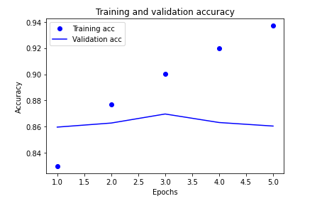
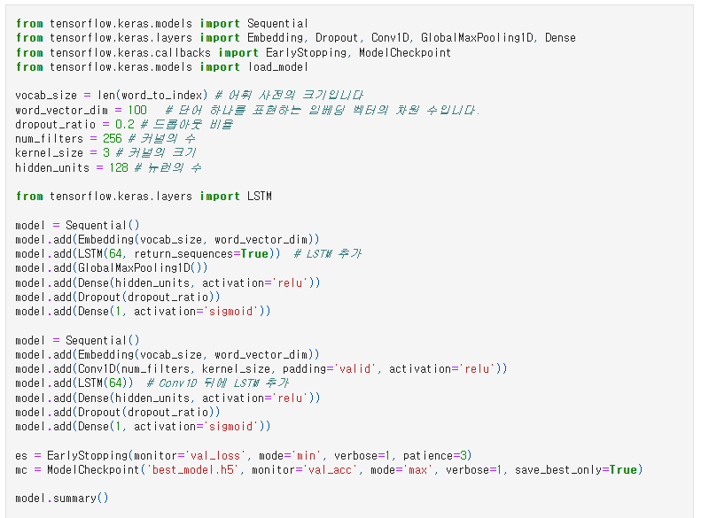
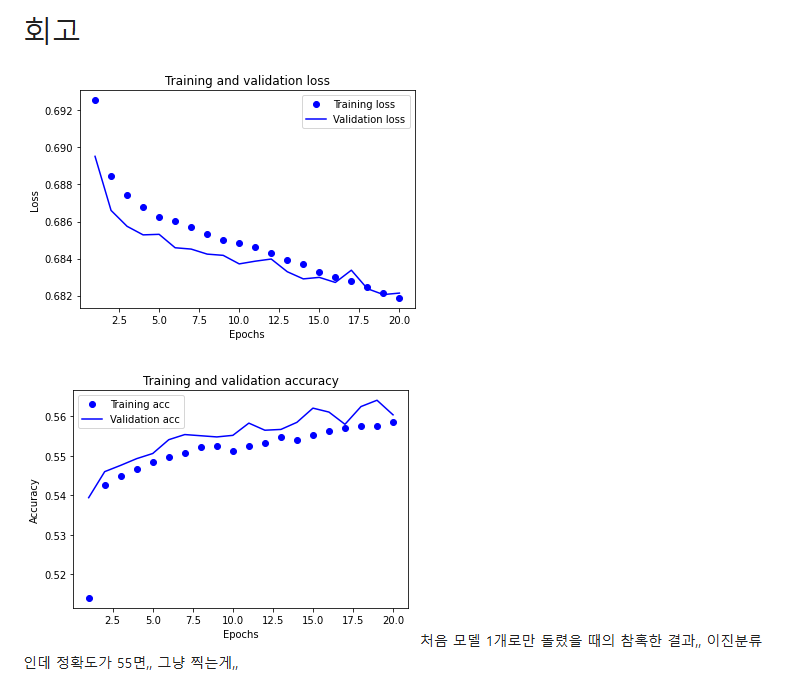
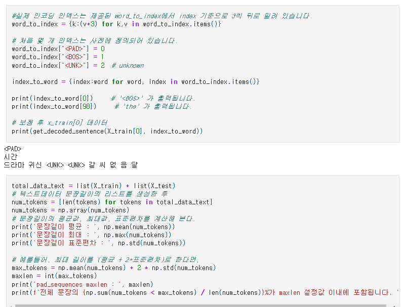

# AIFFEL Campus Online Code Peer Review Templete
- 코더 : 김유은
- 리뷰어 : 염철헌


# PRT(Peer Review Template)
- [X]  **1. 주어진 문제를 해결하는 완성된 코드가 제출되었나요?**
    - 문제에서 요구하는 최종 결과물이 첨부되었는지 확인
        - 중요! 해당 조건을 만족하는 부분을 캡쳐해 근거로 첨부
        - 86퍼센트가 넘는 결과물을 보여주셨다니 충격적입니다.
        - 
    
- [X]  **2. 전체 코드에서 가장 핵심적이거나 가장 복잡하고 이해하기 어려운 부분에 작성된 
주석 또는 doc string을 보고 해당 코드가 잘 이해되었나요?**
    - 해당 코드 블럭을 왜 핵심적이라고 생각하는지 확인
    - 해당 코드 블럭에 doc string/annotation이 달려 있는지 확인
    - 해당 코드의 기능, 존재 이유, 작동 원리 등을 기술했는지 확인
    - 주석을 보고 코드 이해가 잘 되었는지 확인
        - 중요! 잘 작성되었다고 생각되는 부분을 캡쳐해 근거로 첨부
        - 핵심 변수들을 정의하고 주석을 통해서 명확히 표기했음
        - - 
        
- [X]  **3. 에러가 난 부분을 디버깅하여 문제를 해결한 기록을 남겼거나
새로운 시도 또는 추가 실험을 수행해봤나요?**
    - 문제 원인 및 해결 과정을 잘 기록하였는지 확인
    - 프로젝트 평가 기준에 더해 추가적으로 수행한 나만의 시도, 
    실험이 기록되어 있는지 확인
        - 중요! 잘 작성되었다고 생각되는 부분을 캡쳐해 근거로 첨부
        - 회고를 통해서 이진분류의 실패를 기록하고 반성함
        - - 
        
- [X]  **4. 회고를 잘 작성했나요?**
    - 주어진 문제를 해결하는 완성된 코드 내지 프로젝트 결과물에 대해
    배운점과 아쉬운점, 느낀점 등이 기록되어 있는지 확인
    - 전체 코드 실행 플로우를 그래프로 그려서 이해를 돕고 있는지 확인
        - 중요! 잘 작성되었다고 생각되는 부분을 캡쳐해 근거로 첨부
        - 위와 같은데, 첫 번째 시도를 기록하여 회고로 남겼고 그 과정에서 실패를 팀원과 같이 분석했음.
        - 흥미로운점은 모두 이진분류를 실패했을 때 confusion matrix를 보면 아예 1자로 찍는게 나오는거 같은데... 왤까?
        - - 
        
- [X]  **5. 코드가 간결하고 효율적인가요?**
    - 파이썬 스타일 가이드 (PEP8) 를 준수하였는지 확인
    - 코드 중복을 최소화하고 범용적으로 사용할 수 있도록 함수화/모듈화했는지 확인
        - 중요! 잘 작성되었다고 생각되는 부분을 캡쳐해 근거로 첨부
        - 예시코드와 학습노드를 참고하여 플로우가 한 눈에 보이도록 작성하셨음
        - - 


# 회고(참고 링크 및 코드 개선)
```
# 리뷰어의 회고를 작성합니다.
# 85퍼를 뛰어넘으셨다니 정말 말도 안되는 일이라고 느껴질 정도로 놀랍습니다. 절대 안되던데 . ..
# conv랑 lstm 을 합쳐서 모델을 구성한 부분에 대해서 어떻게 구성했나 궁금했는데 잘 되어있어서 한 수 배웠고,
# 무엇보다 예시답안 의 존재를 알려주셔서 감사드려요.
# 코드 리뷰 시 참고한 링크가 있다면 링크와 간략한 설명을 첨부합니다.
# 코드 리뷰를 통해 개선한 코드가 있다면 코드와 간략한 설명을 첨부합니다.
```
