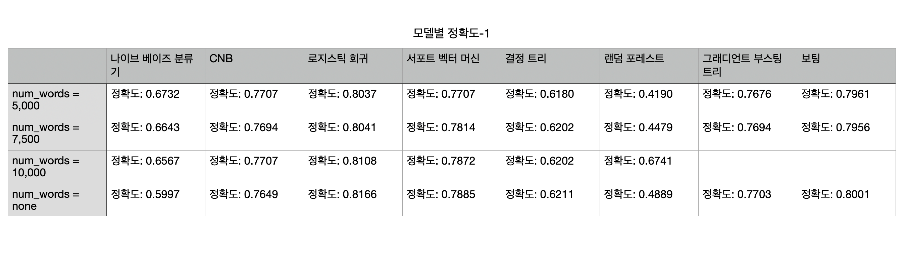
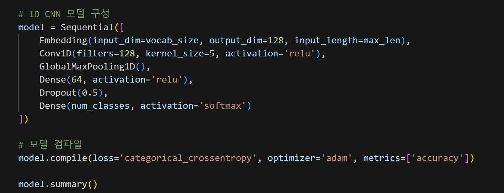
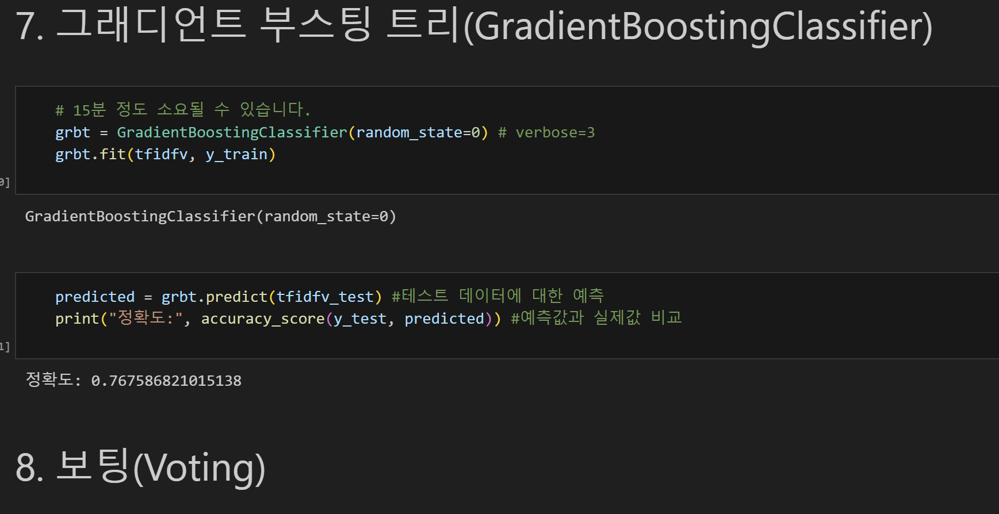
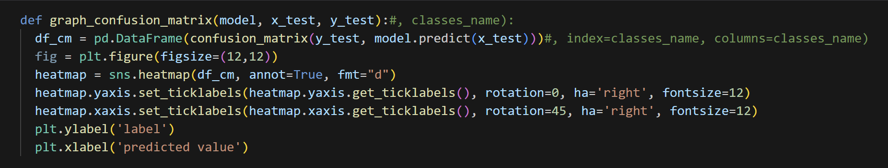
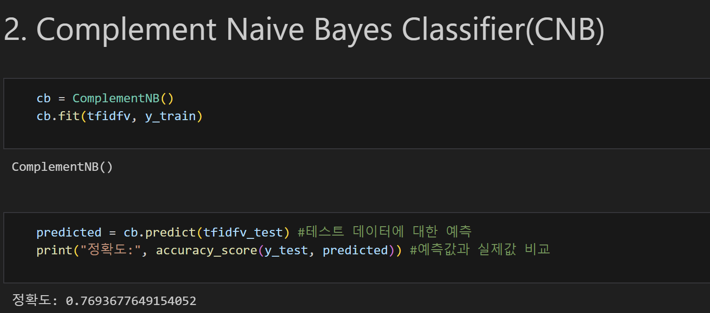

# AIFFEL Campus Online Code Peer Review Templete
- 코더 : 김유은
- 리뷰어 : 손병진


# PRT(Peer Review Template)
- [x]  **1. 주어진 문제를 해결하는 완성된 코드가 제출되었나요?**
    - vocab size를 바꿔가며 여러 종류의 머신러닝 모델을 학습시키고 성능비교를 진행함.
        
    
- [x]  **2. 전체 코드에서 가장 핵심적이거나 가장 복잡하고 이해하기 어려운 부분에 작성된 주석 또는 doc string을 보고 해당 코드가 잘 이해되었나요?**
    - 각 머신러닝 모델 구현과 딥러닝 모델 구현 코드가 명확하고 보기 쉽게 작성되어 있음.
        
        
        
- [x]  **3. 에러가 난 부분을 디버깅하여 문제를 해결한 기록을 남겼거나 새로운 시도 또는 추가 실험을 수행해봤나요?**
    - 예상한 결과와 다른 부분에 대한 고민과 정리가 잘되어 있음.
        
        
- [x]  **4. 회고를 잘 작성했나요?**
    - 본 실험으로 추가로 생긴 의문과 궁금점을 기록.
        
        
- [x]  **5. 코드가 간결하고 효율적인가요?**
    - 함수를 활용한 코드 모듈화, 마크다운을 활용한 코드 설명으로 가독성이 좋음
        
        


# 회고(참고 링크 및 코드 개선)
- 랜덤 포레스트 정확도가 num_words=10000일때 갑자기 올라간것에 저도 똑같이 의문이 들었습니다. 추가 테스트로 왜 그런 결과가 일어났는지 공유해주시면 감사하겠습니다.
- 전체적인 모델 성능이 유사하나 로지스틱 회귀랑 SVM의 결과가 저희 조 실험이랑 달라 인상깊었습니다.


```bash
AIFFEL_quest_rs
├── MainQuest
│   ├── Quest01
│   │   ├── .ipynb
│   │   └── README.md
│   ├── Quest02
│   │   ├── .ipynb
│   │   └── README.md
│   ├── Quest03
│   │   ├── .ipynb
│   │   └── README.md
│   ├── Quest04
│   │   ├── .ipynb
│   │   └── README.md
│   ├── Quest05
│   │   ├── .ipynb
│   │   └── README.md
│   ├── Quest06
│   │   ├── .ipynb
│   │   └── README.md
│   ├── Quest07
│   │   ├── .ipynb
│   │   └── README.md
│   ├── Quest08
│   │   ├── .ipynb
│   │   └── README.md
│   └── Quest09
│       ├── .ipynb
│       └── README.md
├── Exploration
│   ├── Ex01
│   │   ├── .ipynb
│   │   └── README.md
│   ├── Ex02
│   │   ├── .ipynb
│   │   └── README.md
│   ├── Ex03
│   │   ├── .ipynb
│   │   └── README.md
│   ├── Ex04
│   │   ├── .ipynb
│   │   └── README.md
│   └── Ex05
│       ├── .ipynb
│       └── README.md
└──Going Deper
.
.
.
```
