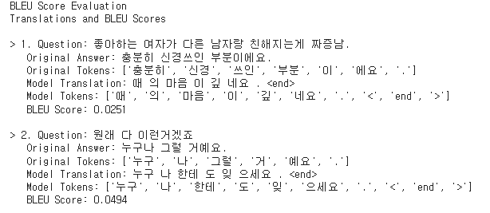
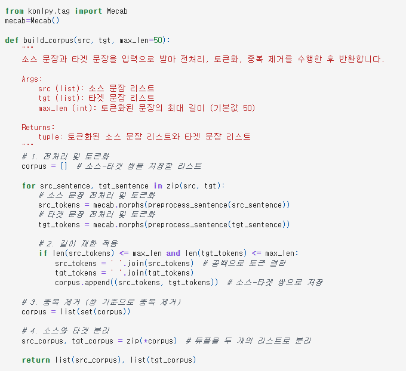
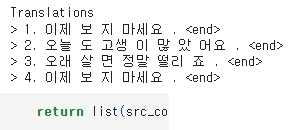
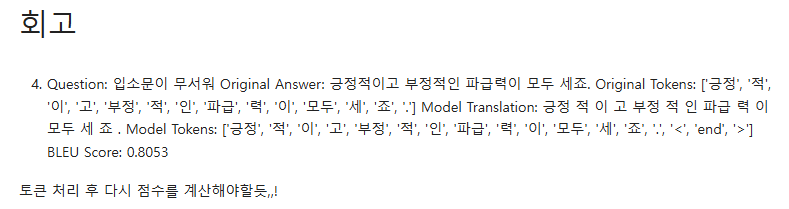
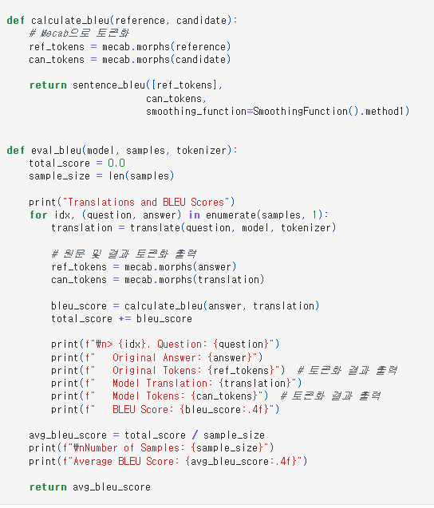

# AIFFEL Campus Online Code Peer Review Templete
- 코더 : 김유은
- 리뷰어 : 염철헌


# PRT(Peer Review Template)
- [X]  **1. 주어진 문제를 해결하는 완성된 코드가 제출되었나요?**
    - 문제에서 요구하는 최종 결과물이 첨부되었는지 확인
        - 중요! 해당 조건을 만족하는 부분을 캡쳐해 근거로 첨부
        - 트랜스포머 모델을 통해서 예측 문장을 생성하고, 훈련 데이터에 대해서 정답 레이블과 비교 및 BLEU 스코어를 계산하는 예제를 수행
        - 
    
- [X]  **2. 전체 코드에서 가장 핵심적이거나 가장 복잡하고 이해하기 어려운 부분에 작성된 
주석 또는 doc string을 보고 해당 코드가 잘 이해되었나요?**
    - 해당 코드 블럭을 왜 핵심적이라고 생각하는지 확인
    - 해당 코드 블럭에 doc string/annotation이 달려 있는지 확인
    - 해당 코드의 기능, 존재 이유, 작동 원리 등을 기술했는지 확인
    - 주석을 보고 코드 이해가 잘 되었는지 확인
        - 중요! 잘 작성되었다고 생각되는 부분을 캡쳐해 근거로 첨부
        - Mecab을 활용해서 데이터 전처리 하는 부분에 대해 길이 제한, 중복 제거, 코퍼스 분리 등의 작업이 순서대로 잘 나열되어 있음
        - 
        
- []  **3. 에러가 난 부분을 디버깅하여 문제를 해결한 기록을 남겼거나
새로운 시도 또는 추가 실험을 수행해봤나요?**
    - 문제 원인 및 해결 과정을 잘 기록하였는지 확인
    - 프로젝트 평가 기준에 더해 추가적으로 수행한 나만의 시도, 
    실험이 기록되어 있는지 확인
        - 중요! 잘 작성되었다고 생각되는 부분을 캡쳐해 근거로 첨부
        - 시간적인 문제로 인해 추가적인 실험은 남기지 못 하였지만, 여러 파라미터에 대해서 재실험 중이며 피드백 과정에서 반복되는 문장이 형성되는 부분을 지적하였고 그에 대한 토론을 할 수 있었음
        - "이제 보 지 마세요" 등 빈출 문장에 대한 인사이트를 얻음
        - 
        
- [X]  **4. 회고를 잘 작성했나요?**
    - 주어진 문제를 해결하는 완성된 코드 내지 프로젝트 결과물에 대해
    배운점과 아쉬운점, 느낀점 등이 기록되어 있는지 확인
    - 전체 코드 실행 플로우를 그래프로 그려서 이해를 돕고 있는지 확인
        - 중요! 잘 작성되었다고 생각되는 부분을 캡쳐해 근거로 첨부
        - BLEU score 계산하는 데에 "."이나 "end" 토큰 등 불필요한 것이 첨가되어 있는 것을 회고에서 캐치하였음
        - 
        
- [X]  **5. 코드가 간결하고 효율적인가요?**
    - 파이썬 스타일 가이드 (PEP8) 를 준수하였는지 확인
    - 코드 중복을 최소화하고 범용적으로 사용할 수 있도록 함수화/모듈화했는지 확인
        - 중요! 잘 작성되었다고 생각되는 부분을 캡쳐해 근거로 첨부
        - BLEU score 계산 부분을 함수화하여 깔끔하게 정리
        - 


# 회고(참고 링크 및 코드 개선)
```
# 리뷰어의 회고를 작성합니다.
# 각 스텝을 명료하게 진행하셔서 보기 편했고, 전처리나 토큰화는 저랑 방식이 달라서 각각의 결과를 비교해본 것도 재미있었습니다.
```

```bash
AIFFEL_quest_rs
├── MainQuest
│   ├── Quest01
│   │   ├── .ipynb
│   │   └── README.md
│   ├── Quest02
│   │   ├── .ipynb
│   │   └── README.md
│   ├── Quest03
│   │   ├── .ipynb
│   │   └── README.md
│   ├── Quest04
│   │   ├── .ipynb
│   │   └── README.md
│   ├── Quest05
│   │   ├── .ipynb
│   │   └── README.md
│   ├── Quest06
│   │   ├── .ipynb
│   │   └── README.md
│   ├── Quest07
│   │   ├── .ipynb
│   │   └── README.md
│   ├── Quest08
│   │   ├── .ipynb
│   │   └── README.md
│   └── Quest09
│       ├── .ipynb
│       └── README.md
├── Exploration
│   ├── Ex01
│   │   ├── .ipynb
│   │   └── README.md
│   ├── Ex02
│   │   ├── .ipynb
│   │   └── README.md
│   ├── Ex03
│   │   ├── .ipynb
│   │   └── README.md
│   ├── Ex04
│   │   ├── .ipynb
│   │   └── README.md
│   └── Ex05
│       ├── .ipynb
│       └── README.md
└──Going Deper
.
.
.
```
